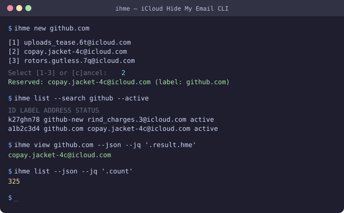

<p align="center">
  <h1 align="center">ihme</h1>
  <p align="center">
    iCloud Hide My Email, from the terminal.<br>
    For humans who pick. For agents who script. For scripts that just run.
  </p>
</p>

<p align="center">
  <a href="https://github.com/lroolle/ihme-cli/releases"></a>
  <a href="https://github.com/lroolle/ihme-cli/actions/workflows/ci.yml"></a>
  <a href="https://go.dev"></a>
  <a href="LICENSE"></a>
</p>

<p align="center">
  
</p>

> **Note**: Unofficial tool. Uses Apple's undocumented iCloud web API. Not affiliated with Apple. Use at your own risk.

## Install

**Download binary** (no Go required):

```bash
# macOS (Apple Silicon)
curl -L https://github.com/lroolle/ihme-cli/releases/latest/download/ihme-darwin-arm64 -o ihme
chmod +x ihme && sudo mv ihme /usr/local/bin/

# Linux
curl -L https://github.com/lroolle/ihme-cli/releases/latest/download/ihme-linux-amd64 -o ihme
chmod +x ihme && sudo mv ihme /usr/local/bin/
```

**Go install:**

```bash
go install github.com/lroolle/ihme-cli/cmd/ihme@latest
```

**Build from source:**

```bash
git clone https://github.com/lroolle/ihme-cli.git && cd ihme-cli && make install
```

<details>
<summary><strong>Install via Claude Code</strong> — paste this into Claude Code:</summary>

```
Install the ihme CLI for iCloud Hide My Email management:
1. Run: go install github.com/lroolle/ihme-cli/cmd/ihme@latest
2. Copy the skill file: mkdir -p ~/.claude/skills/ihme-cli && curl -o ~/.claude/skills/ihme-cli/SKILL.md https://raw.githubusercontent.com/lroolle/ihme-cli/main/skill/SKILL.md
3. Run: ihme auth login
```

</details>

## Quick start

```bash
ihme auth login                    # Sign in (Apple ID + 2FA)
ihme list                          # See all your addresses
ihme list --search netflix         # Find one
ihme new github.com                # Create (pick from 3 candidates)
ihme view github.com               # Details
ihme export -o backup.csv          # Export everything
```

## How `ihme new` works

Matches the iCloud web flow — generate candidates, pick the one you like, reserve it:

```
$ ihme new github.com --tag dev

  [1] uploads_tease.6t@icloud.com
  [2] copay.jacket-4c@icloud.com
  [3] rotors.gutless.7q@icloud.com

Select [1-3] or [c]ancel: 2
Reserved: copay.jacket-4c@icloud.com (label: github.com)
```

| Who | Command | What happens |
|-----|---------|-------------|
| Human | `ihme new github.com` | Show ~3 candidates, pick interactively |
| Agent | `ihme new github.com --json` then `--address <pick>` | Get candidates, reserve one |
| Script | `ihme new github.com -y` | Take first, reserve, done |

## All commands

```
AUTH
  ihme auth login                Sign in with Apple ID (SRP + 2FA)
  ihme auth status [--json]      Session state
  ihme auth logout               Clear session

LIST & SEARCH
  ihme list                      All addresses (table)
  ihme list --search <query>     Search label, address, or note
  ihme list --active             Only active
  ihme list --tag <tag>          Filter by tag
  ihme list --sort label         Sort by label or date

CREATE
  ihme new <label>               Interactive: pick from ~3 candidates
  ihme new <label> --yes         Script: take first
  ihme new <label> --json        Agent: get candidates without reserving

MANAGE
  ihme view <ref>                View details
  ihme edit <ref>                Edit label, note, tags
  ihme copy <ref>                Copy address to clipboard
  ihme deactivate <ref>          Stop receiving mail
  ihme reactivate <ref>          Resume receiving mail
  ihme delete <ref> [--yes]      Permanent deletion (confirms first)

EXPORT
  ihme export                    CSV to stdout
  ihme export --format json      JSON to stdout
  ihme export -o file.csv        To file
  ihme export --search dev       Filtered export

FORWARD
  ihme forward [--json]          Show forward-to address
  ihme forward set <email>       Change it
```

`<ref>` resolves by: anonymousId > email > label (exact) > label (fuzzy).

## JSON & jq

Every command supports `--json` and `--jq`. Response shapes are in `ihme <cmd> --help`.

```bash
# First 5 addresses
ihme list --json --jq '.addresses[0:5]'

# Just the email strings
ihme list --search github --json --jq '.addresses[].hme'

# Address count
ihme list --json --jq '.count'

# Get one address field
ihme view github.com --json --jq '.result.hme'

# Agent: generate candidates, pick, reserve
ihme new mysite.com --json | jq '.candidates'
ihme new mysite.com --address chosen@icloud.com --json
```

## Agent integration

Built for AI agents (Claude Code, GPT, etc.):

| Feature | How |
|---------|-----|
| **Response schemas** | Documented in every `--help` |
| **Next-action hints** | JSON output includes `hints` with follow-up commands |
| **Actionable errors** | Wrong usage returns the fix: `Usage: ihme view <ref>` |
| **No prompts** | `--yes` skips all interactive confirmation |
| **Exit codes** | 0 success, 1 error, 2 auth required |
| **Composable** | stdout = data, stderr = status |

Ships with a Claude Code skill: [`skill/SKILL.md`](skill/SKILL.md)

## Tags

Shared convention with the [browser extension](https://github.com/dedoussis/icloud-hide-my-email-browser-extension):

```bash
ihme new example.com --tag shopping --note "prime account"
# Stored as: #shopping | prime account

ihme list --tag shopping
ihme edit example.com --tag shopping,personal
```

## Auth details

SRP-6a over `idmsa.apple.com`. Password never transmitted.

- 2FA: SMS or trusted device push (iOS 26.4+ supported)
- Trust token: ~30 days, skips 2FA on subsequent logins
- Session: `~/Library/Application Support/ihme/session.json` (macOS) or `~/.config/ihme/session.json` (Linux)
- Credentials never stored. File permissions `0600`.
- Override path: `IHME_SESSION_PATH`

## Limits

| Limit | Value |
|-------|-------|
| Addresses per 30 min | ~5 |
| Total per account | ~750 |
| Trust token lifetime | ~30 days |
| Candidate pool | ~3 unique |

## Development

```bash
make              # build
make test         # tests
make test-cover   # with coverage
make check        # vet + test + build
make cross        # linux/darwin/windows x amd64/arm64
make completions  # bash/zsh/fish
```

## License

[MIT](LICENSE)
